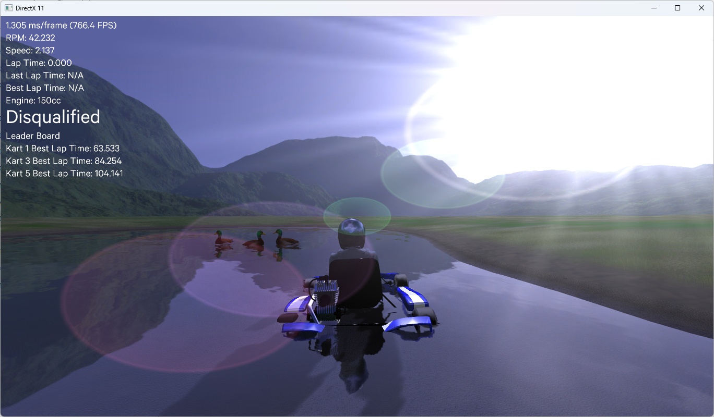

# Lightweight Educational Game Engine



*Caption: Real-time rendering with advanced lighting and physics*

A lightweight, educational game engine built with C++ and DirectX 11, featuring a complete go-karting game example. This project demonstrates modern 3D graphics techniques and serves as a learning resource for game engine development.

## Features

### Core Engine Systems
- **DirectX 11 Rendering Pipeline** - Modern graphics API implementation
- **Resource Management** - Efficient loading and of assets
- **Scene Graph** - Hierarchical scene asset organization

### Graphics & Rendering 
[Watch Graphics Features Video](https://www.youtube.com/watch?v=haYDym8bzO4) (Low Quality)
- **Multiple Light Types** - Point, directional, and spot lights with real-time shadows
- **Advanced Materials** - PBR-style material system with multiple texture support
- **3D Model Loading** - Support for complex meshes and materials via Assimp
- **Skeletal Animation** - Full bone-based animation system with skinning
- **Terrain Rendering** - Height-based terrain with texture blending
- **Water Rendering** - Realistic water surfaces with reflections
- **Dynamic Cubemaps** - Real-time environment mapping for reflections
- **Post-Processing Effects**:
  - Bloom lighting effects
  - Lens flare system
  - Advanced shadow mapping
  - Shadow volumes for dynamic objects
- **Foliage Rendering** - Optimized grass and vegetation systems
- **Subsurface Scattering** - Realistic skin rendering techniques
-  [Watch skin rendering video](https://www.youtube.com/watch?v=Zt6Al5h8oL4)

### Camera Systems
- **Multiple Camera Types** - First-person, third-person, and cinematic cameras
- **Smooth Transitions** - Interpolated camera movement and targeting
- **Debug Camera** - Free-flying camera for development

### Audio & Physics
- **3D Audio** - Spatial audio system powered by FMOD
- **Physics Simulation** - Realistic physics using NVIDIA PhysX
- **Collision Detection** - Comprehensive collision system for gameplay

### Tools & Utilities
- **ImGui Integration** - In-engine debugging and tweaking interface
- **XML Configuration** - Scene and settings management via TinyXML

## Source Code
**[🔗 GameEngine Source Code Link](https://github.com/Carl-Jones-Git/GameEngine/tree/main/Resources/Libs/Source)**

**[🔗 Karting "Scene" Source Code Link](https://github.com/Carl-Jones-Git/GameEngine/tree/main/DX11_Karting%20-%20VS2022/Source)**

## Design Philosophy

### Direct Public Access Pattern
Following common practice in game engines and mathematics libraries, many classes in this engine use public member variables accessed directly rather than getter/setter methods. This design choice offers several advantages:

**Performance Benefits:**
- Eliminates function call overhead for frequently accessed data (critical when processing thousands of objects per frame)
- Enables better compiler optimizations and more predictable memory access patterns
- Reduces cache misses when working with arrays of objects like vertices or particles

**Development Efficiency:**
- Simplifies debugging by allowing direct inspection and modification of values
- Reduces boilerplate code for simple data containers like Vector3, Color, or Transform classes
- Enables faster prototyping and iteration during development

This approach is used selectively for simple data structures and mathematical types, while complex systems that require validation or coordination still use proper encapsulation.

## Example Game: Go-Kart Racing

The included go-kart racing game demonstrates all engine features in action across multiple platforms:

### Platform Support
- **PC Version** (`KartingPC/`) - Full-featured desktop implementation
- **Xbox One Version** (`KartingXBoxOne/`) - Console-optimized build


### Game Features
- Physics-based kart handling with realistic suspension
- Dynamic track environments with multiple surface types
- Advanced lighting and atmospheric effects
- Real-time reflections on kart surfaces and track elements
- Spatial audio with engine sounds and environmental effects
- [Watch GamePlay Video](https://www.youtube.com/watch?v=UWeHYNR9bro)

## Dependencies

This project uses the following open-source libraries:

- **[ImGui](https://github.com/ocornut/imgui)** - Immediate mode GUI for debugging interface
- **[FMOD](https://www.fmod.com/)** - Professional audio engine for 3D sound
- **[NVIDIA PhysX](https://github.com/NVIDIAGameWorks/PhysX)** - Real-time physics simulation
- **[TinyXML](https://github.com/leethomason/tinyxml2)** - Lightweight XML parsing
- **[Assimp](https://github.com/assimp/assimp)** - 3D model loading and processing

## Requirements

- **Platform**: Windows 10/11 (PC), Xbox One/Series X|S
- **Graphics**: DirectX 11 compatible GPU
- **Compiler**: Visual Studio 2019 or later with C++17 support
- **RAM**: 4GB minimum, 8GB recommended
- **Xbox Development**: Xbox One Development Kit for console builds

## Runtime
1. **Clone the repository:**
   ```bash
   git clone --recursive https://github.com/Carl-Jones-Git/GameEngine.git
   ```
2. **Run DX11Proj.exe:**
    - Navigate to the "DX11_Karting - Windows11_Runtime" folder and run DX11Proj.exe

## Building

1. **Clone the repository:**
   ```bash
   git clone --recursive https://github.com/Carl-Jones-Git/GameEngine.git
   ```
   
2. **Open the solution in Visual Studio:**
   - Navigate to the desired solution folder (KartingPC or KartingXBoxOne)
   - Open the `.sln` file with Visual Studio 2022 or later
   - To build for KartingXBoxOne navigate to Includes.h and comment #define PC_BUILD

4. **Restore NuGet packages:**
   - Right-click on the solution in Solution Explorer
   - Select "Restore NuGet Packages"
   - Wait for all packages to download and install

5. **Set build configuration:**
   - Select "Release" or "Debug" configuration

6. **Build the solution:**
   - Press `Ctrl+Shift+B` or go to Build → Build Solution

7. **Run the application:**
   - Press `F5` to run with debugging or `Ctrl+F5` to run without debugging

**Note:** NuGet packages are not included in the repository to keep download size manageable. Visual Studio will automatically download all required dependencies during the restore process.

## Project Structure

```
├── Game/
│   ├── KartingPC/               # Go-kart game implementation (PC)
|   ├── KartingWindows11Runtime/ # Go-kart game runtime (PC)
│   └── KartingXBoxOne/          # Go-kart game implementation (Xbox One)
└── Resources/
    ├── Libs/
    │   ├── Source/          # Core engine source code
    │   └── /                # Third-party libraries
    ├── Levels/              # Game levels and scenes
    ├── Models/              # 3D models and meshes
    ├── Textures/            # Texture assets
    ├── Sounds/              # Audio files
    ├── Shaders/             # HLSL shader files
    └── Documentation/       # Additional docs and tutorials
```

## Learning Resources

This engine is designed for educational purposes and includes:
- Well-commented source code explaining techniques
- Examples of when to use public access vs. encapsulation

The following are available on request:
- Step-by-step tutorials for key systems
- Performance profiling examples
- Shader development guides

## Controls

### Go-Kart Game
- **WASD** - Steering and acceleration
- **Space** - Handbrake
- **C** - Change camera view
- **F1** - Toggle debug interface
- **ESC** - Pause/Menu

## Contributing

This is an educational project welcoming contributions! Please see [CONTRIBUTING.md](CONTRIBUTING.md) for guidelines.

## License

This project is licensed under the MIT License - see the [LICENSE](LICENSE) file for details.

## Acknowledgments

- Thanks to the open-source community for the excellent libraries
- Inspired by modern game engines and real-time rendering research
- Educational resources from graphics programming communities

